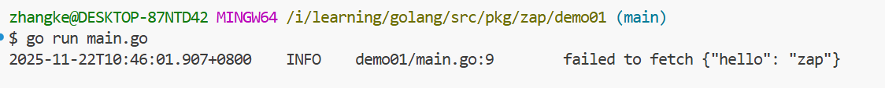
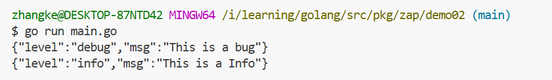
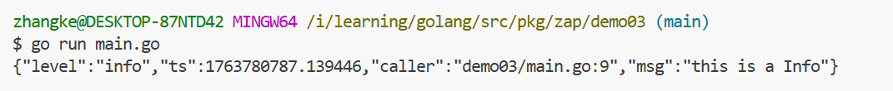

# Zap

## 一、简介

[zap](https://github.com/uber-go/zap) 是 [uber](https://github.com/uber-go) 开源的一个高性能，结构化，分级记录的日志记录包。

> go1.20.2
>
> zap v1.24.0

### zap的特性

- 高性能：zap 对日志输出进行了多项优化以提高它的性能

- 日志分级：有 Debug，Info，Warn，Error，DPanic，Panic，Fatal 等

- 日志记录结构化：日志内容记录是结构化的，比如 json 格式输出

- 自定义格式：用户可以自定义输出的日志格式

- 自定义公共字段：用户可以自定义公共字段，大家输出的日志内容就共同拥有了这些字段

- 调试：可以打印文件名、函数名、行号、日志时间等，便于调试程序

- 自定义调用栈级别：可以根据日志级别输出它的调用栈信息

- Namespace：日志命名空间。定义命名空间后，所有日志内容就在这个命名空间下。命名空间相当于一个文件夹

- 支持 hook 操作

  ----

## 二、quickstart

1、Zap的安装

```shell
go get -u go.uber.org/zap
```

2、创建日志器

```go
logger, _ := zap.NewProduction()
```

3、使用 

```go
name := "zap"
logger.Info("field fetch to", zap.String("Hello ",  name))
```


完整代码

```go
package main

import "go.uber.org/zap"

func main() {
	logger, _ := zap.NewDevelopment()
	defer logger.Sync()
	name := "zap"
	logger.Info("failed to fetch", zap.String("hello", name))
}

```




## 三、NewExample/NewDevelopment/NewProduction使用

zap 为我们提供了三种快速创建 logger 的方法: `zap.NewProduction()`，`zap.NewDevelopment()`，`zap.NewExample()`。

见名思义，Example 一般用在测试代码中，Development 用在开发环境中，Production 用在生成环境中。这三种方法都预先设置好了配置信息。

### NewExample

NewExample 构建一个 logger，专门为在 zap 的测试示例使用。它将 ==DebugLevel== 及以上日志用 JSON 格式标准输出，但它省略了==时间戳和调用函数==，以保持示例输出的简短和确定性。

NewExample的配置。

```go
// https://github.com/uber-go/zap/blob/v1.24.0/logger.go#L127
func NewExample(options ...Option) *Logger {
	encoderCfg := zapcore.EncoderConfig{
        MessageKey:     "msg",  // 日志内容key:val， 前面的key设为msg
		LevelKey:       "level", // 日志级别的key设为level
		NameKey:        "logger", // 日志名
		EncodeLevel:    zapcore.LowercaseLevelEncoder, //日志级别，默认小写
		EncodeTime:     zapcore.ISO8601TimeEncoder, // 日志时间
		EncodeDuration: zapcore.StringDurationEncoder,
	}
	core := zapcore.NewCore(zapcore.NewJSONEncoder(encoderCfg), os.Stdout, DebugLevel)
	return New(core).WithOptions(options...)
}
```

案例

```go
package main

import "go.uber.org/zap"

func main(){

	logger := zap.NewExample()
	logger.Debug("This is a bug")
	logger.Info("This is a Info")
}

```




### **NewDevelopment() **

NewDevelopment() 构建一个开发使用的 Logger，它以人性化的格式将 ==DebugLevel==及以上日志信息输出。它的底层使用


配置：

```go
func NewDevelopmentEncoderConfig() zapcore.EncoderConfig {
	return zapcore.EncoderConfig{
		// Keys can be anything except the empty string.
		TimeKey:        "T",
		LevelKey:       "L",
		NameKey:        "N",
		CallerKey:      "C",
		FunctionKey:    zapcore.OmitKey,
		MessageKey:     "M",
		StacktraceKey:  "S",
		LineEnding:     zapcore.DefaultLineEnding,
		EncodeLevel:    zapcore.CapitalLevelEncoder,
		EncodeTime:     zapcore.ISO8601TimeEncoder,
		EncodeDuration: zapcore.StringDurationEncoder,
		EncodeCaller:   zapcore.ShortCallerEncoder,
	}
}
```


案例：

```go
package main

import (
	"time"

	"go.uber.org/zap"
)

func main() {
	logger, _ := zap.NewDevelopment()
	defer logger.Sync()

	logger.Info("failed to fetch url",
		// 强类型字段
		zap.String("url", "http://example.com"),
		zap.Int("attempt", 3),
		zap.Duration("duration", time.Second),
	)

	logger.With(
		// 强类型字段
		zap.String("url", "http://development.com"),
		zap.Int("attempt", 4),
		zap.Duration("duration", time.Second*5),
	).Info("[With] failed to fetch url")
}
```


### **NewProduction**

NewProduction() 构建了一个合理的 Prouction 日志记录器，它将 info 及以上的日志内容以 JSON 格式记写入标准错误里。

```go
func NewProductionConfig() Config {
	return Config{
		Level:       NewAtomicLevelAt(InfoLevel),
		Development: false,
		Sampling: &SamplingConfig{
			Initial:    100,
			Thereafter: 100,
		},
		Encoding:         "json",
		EncoderConfig:    NewProductionEncoderConfig(),
		OutputPaths:      []string{"stderr"},
		ErrorOutputPaths: []string{"stderr"},
	}
}
```


案例

```go
package main

import "go.uber.org/zap"

func main(){
	logger,  _ := zap.NewProduction()
	defer logger.Sync()
	logger.Debug("this is a bug")
	logger.Info("this is a Info")
}

```




## 四、Sugar

- sugared logger：

> 1. 它有很好的性能，比一般日志包快 4-10 倍。
> 2. 支持结构化的日志。
> 3. 支持 printf 风格的日志。
> 4. 日志字段不需要定义类型

Sugar和logger的最大区别就在于， Sugar的日志字段不需要定义类型


Sugar和logger可以互相转换

```go
// 创建 logger
logger := zap.NewExample()
defer logger.Sync()

// 转换 SugaredLogger
sugar := logger.Sugar()

// 转换 logger
plain := sugar.Desugar()
```


- 需要不错的性能但不是很重要的情况下，可以选择 sugaredlogger。它支持结构化日志和 printf 风格的日志记录。sugaredlogger 的日志记录是松散类型的，不是强类型，能接受可变数量的键值对。如果你要用强类型字段记录，可以使用 SugaredLogger.With 方法。
- 如果是每次或每微秒记录日志都很重要情况下，可以使用 logger，它比 sugaredlogger 每次分配内存更少，性能更高。但它仅支持强类型的结构化日志记录。


## 五、自定义配置

快速构建 logger 日志记录器最简单的方法就是用 zap 预定义了配置的方法：`NewExample(), NewProduction()` 和`NewDevelopment()`，这 3 个方法通过单个函数调用就可以构建一个日志计记录器，也可以简单配置。

但是有的项目需要更多的定制，怎么办？zap 的 ==Config== 结构和 zapcore 的 ==EncoderConfig== 结构可以帮助你，让你能够进行自定义配置。


### 配置结构说明

Config 配置项源码：

```Go
Copy// zap v1.24.0
type Config struct {
    // 动态改变日志级别，在运行时你可以安全改变日志级别
	Level AtomicLevel `json:"level" yaml:"level"`
    // 将日志记录器设置为开发模式，在 WarnLevel 及以上级别日志会包含堆栈跟踪信息
	Development bool `json:"development" yaml:"development"`
    // 在日志中停止调用函数所在文件名、行数
	DisableCaller bool `json:"disableCaller" yaml:"disableCaller"`
    // 完全禁止自动堆栈跟踪。默认情况下，在 development 中，warnlevel及以上日志级别会自动捕获堆栈跟踪信息
    // 在 production 中，ErrorLevel 及以上也会自动捕获堆栈信息
	DisableStacktrace bool `json:"disableStacktrace" yaml:"disableStacktrace"`
    // 设置采样策略。没有 SamplingConfing 将禁止采样
	Sampling *SamplingConfig `json:"sampling" yaml:"sampling"`
    // 设置日志编码。可以设置为 console 和 json。也可以通过 RegisterEncoder 设置第三方编码格式
	Encoding string `json:"encoding" yaml:"encoding"`
    // 为encoder编码器设置选项。详细设置信息在 zapcore.zapcore.EncoderConfig
	EncoderConfig zapcore.EncoderConfig `json:"encoderConfig" yaml:"encoderConfig"`
    // 日志输出地址可以是一个 URLs 地址或文件路径，可以设置多个
	OutputPaths []string `json:"outputPaths" yaml:"outputPaths"`
    // 错误日志输出地址。默认输出标准错误信息
	ErrorOutputPaths []string `json:"errorOutputPaths" yaml:"errorOutputPaths"`
    // 可以添加自定义的字段信息到 root logger 中。也就是每条日志都会携带这些字段信息，公共字段
	InitialFields map[string]interface{} `json:"initialFields" yaml:"initialFields"`
}
```

EncoderConfig 结构源码，它里面也有很多配置选项，具体请看 [这里](https://pkg.go.dev/go.uber.org/zap/zapcore@v1.24.0#EncoderConfig):

```go
Copy// zapcore@v1.24.0
type EncoderConfig struct {
    // 为log entry设置key。如果 key 为空，那么在日志中的这部分信息也会省略
	MessageKey     string `json:"messageKey" yaml:"messageKey"`//日志信息的健名，默认为msg
	LevelKey       string `json:"levelKey" yaml:"levelKey"`//日志级别的健名，默认为level
	TimeKey        string `json:"timeKey" yaml:"timeKey"`//记录日志时间的健名，默认为time
	NameKey        string `json:"nameKey" yaml:"nameKey"`
	CallerKey      string `json:"callerKey" yaml:"callerKey"`
	FunctionKey    string `json:"functionKey" yaml:"functionKey"`
	StacktraceKey  string `json:"stacktraceKey" yaml:"stacktraceKey"`
	SkipLineEnding bool   `json:"skipLineEnding" yaml:"skipLineEnding"`
	LineEnding     string `json:"lineEnding" yaml:"lineEnding"`
    // 日志编码的一些设置项
	EncodeLevel    LevelEncoder    `json:"levelEncoder" yaml:"levelEncoder"`
	EncodeTime     TimeEncoder     `json:"timeEncoder" yaml:"timeEncoder"`
	EncodeDuration DurationEncoder `json:"durationEncoder" yaml:"durationEncoder"`
	EncodeCaller   CallerEncoder   `json:"callerEncoder" yaml:"callerEncoder"`
    // 与其它编码器不同， 这个编码器可选
	EncodeName NameEncoder `json:"nameEncoder" yaml:"nameEncoder"`
    // 配置 interface{} 类型编码器。如果没设置，将用 json.Encoder 进行编码
	NewReflectedEncoder func(io.Writer) ReflectedEncoder `json:"-" yaml:"-"`
    // 配置 console 中字段分隔符。默认使用 tab 
	ConsoleSeparator string `json:"consoleSeparator" yaml:"consoleSeparator"`
}
type Entry struct {
	Level      Level
	Time       time.Time
	LoggerName string
	Message    string
	Caller     EntryCaller
	Stack      string
}
```